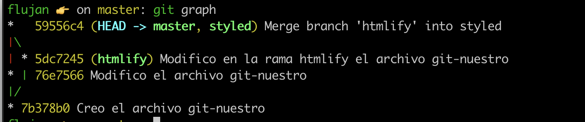

# Practica git

## 11

> Lo he utilizado para deshacer el último commit y dejar mi working copy como estaba antes.

```
git reset --hard HEAD~1
```

## 12

> para ver los pasos que he seguido y ver la referencia del commit.

```
git reflog
```

> para moverse al commit que tenía los cambios.

```
git checkout 76e7566
```

> para eliminar la rama que tenía los cambios antiguos.

```
git branch -d styled
```

> para crear la rama styled.

```
git branch styled
```

> me muevo a la rama styled.

```
git checkout styled
```

## 13

> No causó ningún conflicto, porque no se hizo ningún cambio en la rama master con ese mismo archivo.

## 19

> Sí causó un conflicto porque git detectó que se había hecho un cambio en ese mismo archivo en dos ramas distintas.

## 20

> No causó ningún conflicto porque en master no tiene cambios recientes en ese mismo archivo, tiene cambios antiguos por eso los añade.

## 21

> Utilice un alias que me había creado.

```
git graph
```

> Este es el comando que se utiliza.

```
git log --graph --oneline
```

## 25



## 26

> Si que es fast forward, porque están en el mismo punto del diagrama y no se pierde lar referencia de esa rama.

## 27

```
git reset HEAD~1
```

## 28

```
git restore git-nuestro.md
```

## 29

```
git branch -D title
```

## 30

```
git reflog
git checkout 9f0e3c0
git branch -d master
git checkout -b master
```

## 32

```
git log
git reset --hard HEAD~3
```

## 33

```
git reflog
git checkout 9f0e3c0
```
